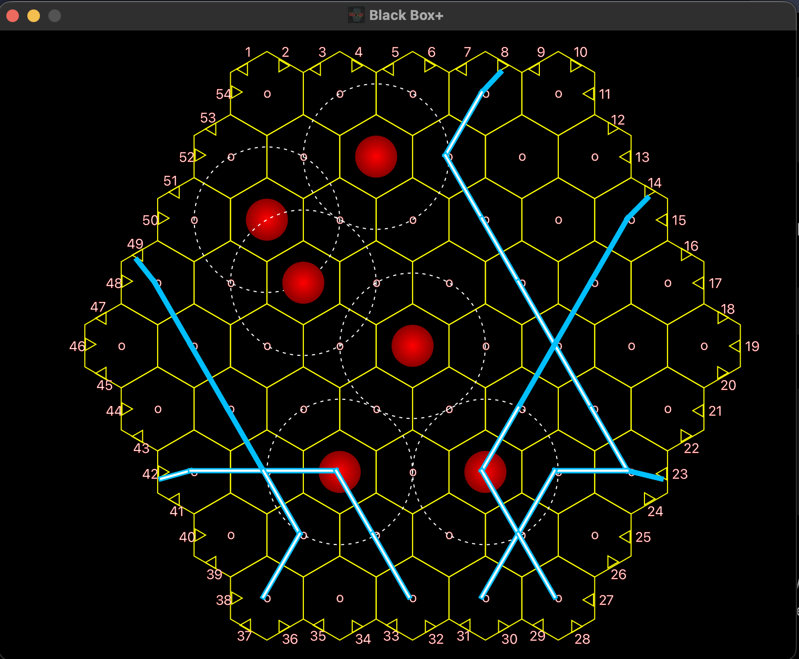

# BlackBox+

BlackBox+ is a JavaFX implementation of the classic Black Box game, built around a hexagonal board where hidden atoms affect the paths of rays fired into the grid.

The project was developed as a three-person Software Engineering team project at University College Dublin.

## Gameplay

Players place atoms on a hexagonal board and interact with numbered arrows positioned around the edge of the grid.

When a ray is fired into the board, its path changes depending on nearby atoms. Rays can travel through the board, be deflected, or interact with atoms based on their position and area of influence.

The implementation includes:

- Interactive hexagonal game board
- Atom placement on board cells
- Numbered arrows positioned around the board
- Ray generation from multiple directions
- Ray and atom interaction logic
- Dynamic ray path calculations
- JavaFX-based graphical interface

## Screenshot

<p align="center">
  
</p>

## My Contributions

My main contributions to the project included:

- Implementing atom placement and representation within the hexagonal board
- Developing the core `Ray` class
- Working on ray movement and interactions with atoms
- Contributing to the logic used to determine ray behaviour based on nearby atoms
- Creating the initial project development flowchart
- Collaborating with teammates on integrating ray, board and interaction mechanics

## Team

This project was developed collaboratively by:

| Team Member |
|---|
| Emmanuel Awe |
| Mohanad Mohamed |
| Sean Okafor |

All three team members contributed to the overall implementation and development of the game.

## Tech Stack

- Java
- JavaFX
- Maven
- Object-Oriented Programming
- Git / GitHub

## Project Structure

```text
BlackBox-Plus/
├── docs/
│   ├── blackbox-gameplay.png
│   └── development-flowchart.pdf
│
├── SWEProject/
│   ├── src/
│   │   └── main/
│   │       ├── java/
│   │       │   └── com/example/sweproject/
│   │       │       ├── Arrow.java
│   │       │       ├── Coordinate.java
│   │       │       ├── GameLauncher.java
│   │       │       ├── Hexagon.java
│   │       │       └── Ray.java
│   │       │
│   │       └── resources/
│   │           └── MainIcon.png
│   │
│   ├── mvnw
│   ├── mvnw.cmd
│   └── pom.xml
│
└── README.md
```

## Running the Project

### Requirements

- Java 21
- macOS, Windows or Linux
- Internet connection on first run so Maven can download dependencies

### Run with Maven Wrapper

Clone the repository:

```bash
git clone https://github.com/Emmanuelawe51/BlackBox-Plus.git
```

Navigate into the Maven project:

```bash
cd BlackBox-Plus/SWEProject
```

On macOS or Linux:

```bash
./mvnw clean javafx:run
```

On Windows:

```bash
mvnw.cmd clean javafx:run
```

The JavaFX application should then launch in a new window.

## Development Flowchart

The original project development flowchart is available here:

[View Development Flowchart](docs/development-flowchart.pdf)

## Key Concepts

The project applies several core software engineering concepts:

- Object-oriented design
- Event-driven user interaction
- Geometric coordinate handling
- Hex-grid modelling
- Ray path calculation
- Collision and proximity-based behaviour
- Team-based Git development

## Authors

Developed by Emmanuel Awe, Mohanad Mohamed and Sean Okafor as part of a Software Engineering project at University College Dublin.